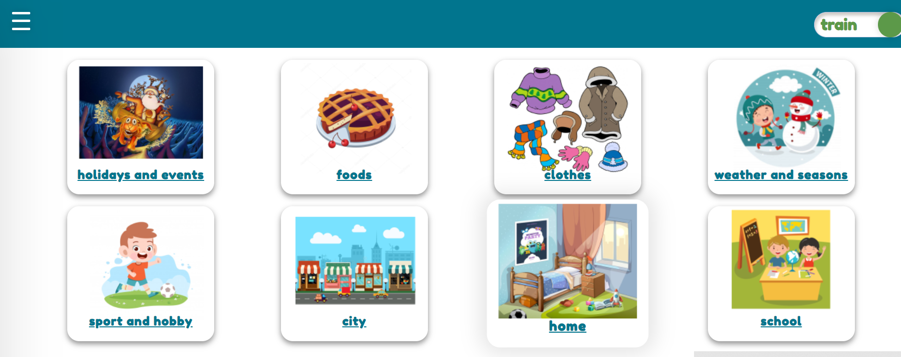

# english-for-kids
A game for children that will help in learning words in English.

***This is one of the projects that I created while studying at RSSchool in the frontend development course. This is an app for learning words in English.
Each word is accompanied by a picture, translation, and pronunciation in English. The game has two modes: study and test. There are also statistics of successful and unsuccessful answers, which will help you practice the words that are the worst to remember.***

[Lets play!](https://english-for-kids-by-game.netlify.app/english-for-kids)

## development stack
+ HTML/Scss
+ JavaScript
+ Webpack
+ Api
+ localStorage

